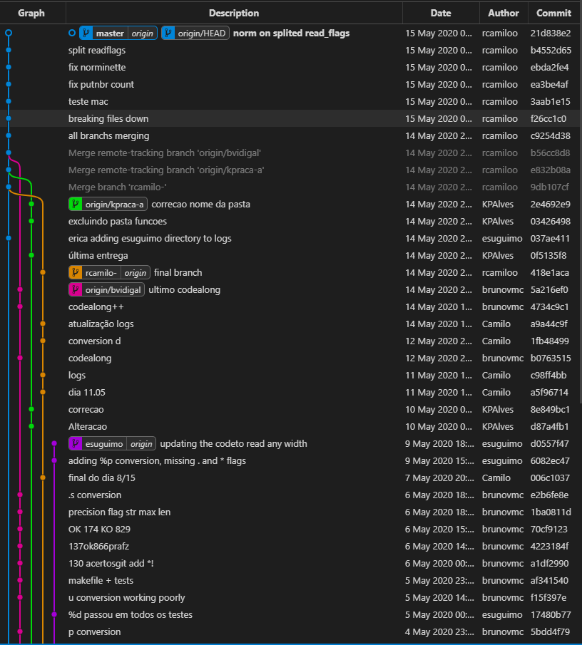
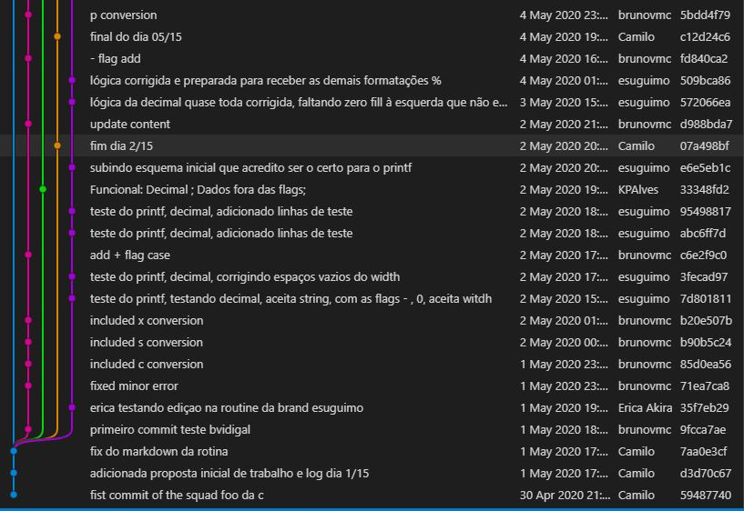

## 14/05/2020 - Dia 15/15

Fechamento do projeto

### O que aprendemos?

- usar melhor o git
- quebrar o código
- debugar o código
- pensar mais na lógica antes de desenvolver
- voltar pras raízes da 42, trabalhando em equipe
- qualidade de código

### O que podemos melhorar?

- Documentar melhor o código, para alguns
- Melhoria de processo, poderíamos todos ter trabalhdo no mesmo código pelo menos 15min 30min todos os dias

### Continuidade do projeto

- continuar cada uma das conversões
- sistema de pair programming com todos

### Nossa time line de commits

